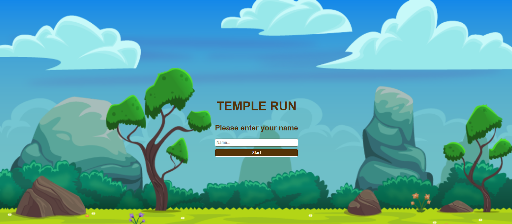
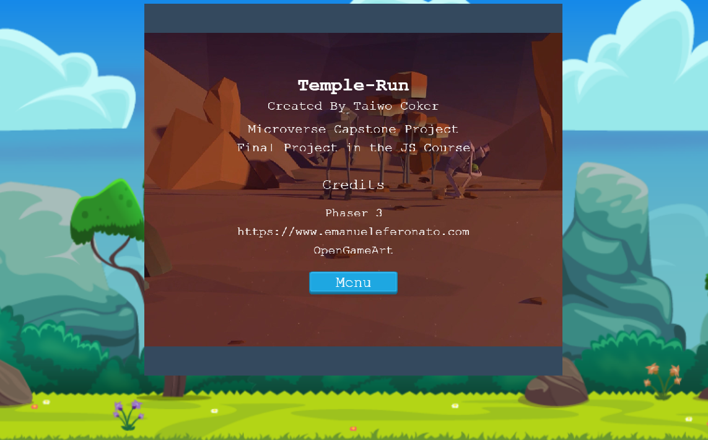
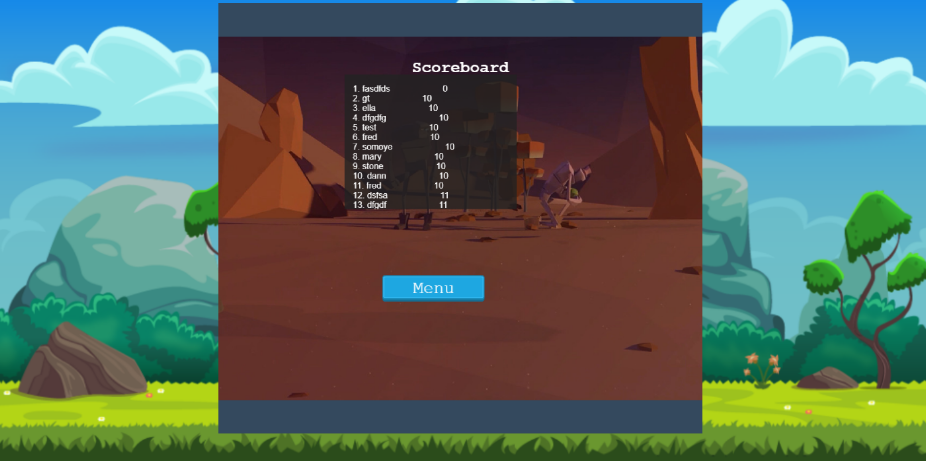
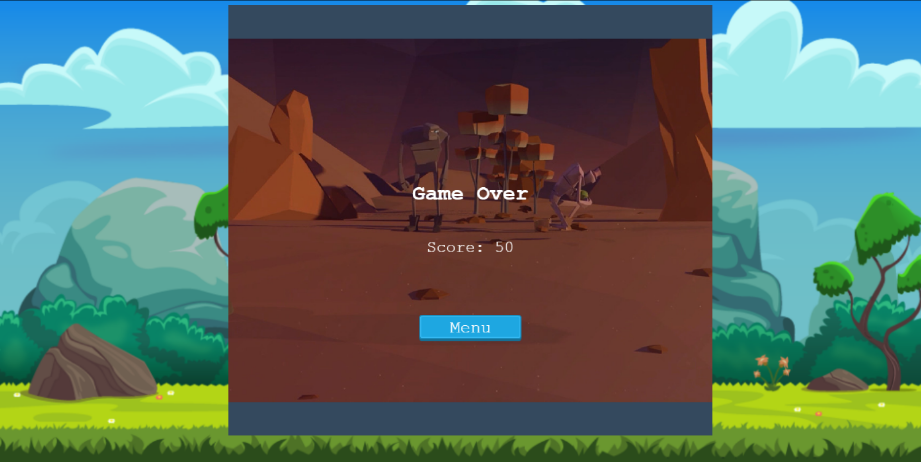

# JavaScript Capstone Project - Platform Game

<h1 align="center">
  Temple-Run
</h1> 

> Final project in the Microverse JavaScript Curriculum

Implementation of a Jump-Based Endless Runner Game built with the [Phaser 3](https://phaser.io/phaser3) framework


## About The Project

The main objective of this project was to build a platform game. The basics of the game are used from the [Endless Runner game](https://www.emanueleferonato.com/2018/11/13/build-a-html5-endless-runner-with-phaser-in-a-few-lines-of-code-using-arcade-physics-and-featuring-object-pooling/) using Phaser and Javascript among other technologies.


Live version of the project: [Live version](https://taiwo-coker-game.netlify.app/)

Project Link: [Javascript-Capstone](https://github.com/taiwocoker/Platform-Game)

## The game

The character runs endlessly on a platform. In the process of the running, the player jumps on the platform and gains points by colliding against coins also avoiding obstacles which is fire for as long as it can because it is an endless journey. When the game is over , the user can restart the game. 

### How to Play

You can jump on the platform by using the upper arrow keys on your keyboard

### How to play

- Input your name on the first page and click the submit button, There is a menu on the next page which are Play, Options, Credits and Scoreboard. You can disable the sound in the options menu. Click on the play menu to start your game. Use the upper arrow on the keyboard to jump from one platform to another and at the same time collide with the coins and avoid fire. Happy gaming!

#### Get a local copy

*npm required* - [get npm](https://www.npmjs.com/get-npm)

### Installation

You can always use the [live version](https://taiwo-coker-game.netlify.app/) to play right away or install it locally using these steps:

**Clone the repository by running this command in your terminal**
```
git clone https://github.com/taiwocoker/Platform-Game.git
```

**Navigate into the newly created folder**
```
cd Platform-Game
```

#### Get the dependencies needed for the game

`$ npm install`

#### Start the server and the fun
`$ npm run dev`

**Visit this link to see the game in your browser** 
```
http://localhost:8080/
```

**Run Jest tests**
```
npm test
```


### Design

All of the sprites, backgrounds, buttons and the background music can be found on [OpenGameArt](https://opengameart.org/)

**Landing Scene**

<p align="center">
  
</p>

**Game Scene**

<p align="center">
  
</p>

**Credits Scene**

<p align="center">
  
</p>

**Leaderboard Scene**

<p align="center">
  
</p>


**Game Over Scene**

<p align="center">
  
</p>

## Technologies used

- JavaScript
- HTML/CSS
- [Phaser 3](https://phaser.io/phaser3)
- Babel
- Webpack
- ESlint
- Jest
- Netlify 
- [Leaderboard API](https://www.notion.so/microverse/Leaderboard-API-service-24c0c3c116974ac49488d4eb0267ade3) for tracking scores

## Contact 

👤 **Taiwo Coker**

- Github: [@githubhandle](https://github.com/taiwocoker)
- Twitter: [@twitterhandle](https://twitter.com/SelloCoker)
- Linkedin: [linkedin](https://linkedin.com/in/taiwo-coker)

## Contributing

Contributions, issues and feature requests are welcome!

Feel free to check the [issues page](https://github.com/taiwocoker/Platform-Game/issues).

## Show your support

Give a ⭐️ if you like this project!

## Acknowledgments

- Microverse
- Phaser 3
- OpenGameArt 
- [https://www.emanueleferonato.com/](https://www.emanueleferonato.com/)
- Webpack
- npm
