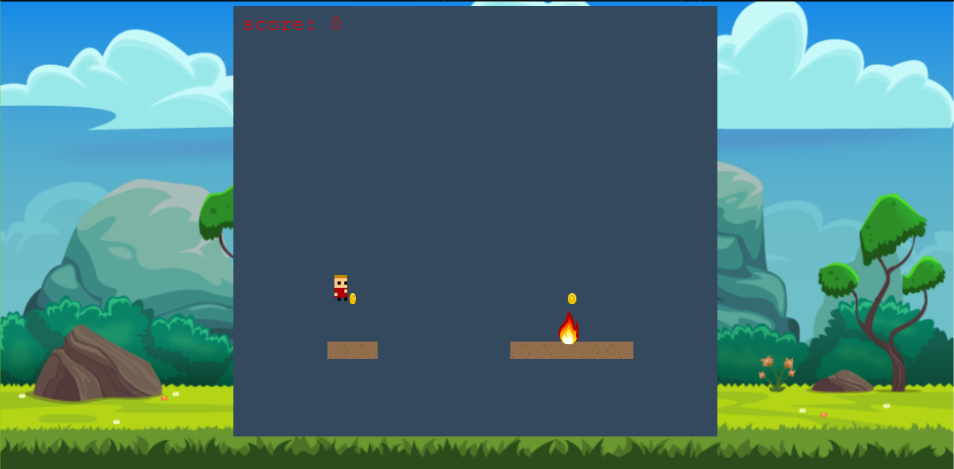

# JavaScript Capstone Project - Platform Game

<h1 align="center">
  Temple-Run
</h1> 

> Final project in the Microverse JavaScript Curriculum

Implementation of a Jump-Based Endless Runner Game built with the [Phaser 3](https://phaser.io/phaser3) framework

## Live Demo

[Play Online](https://taiwo-coker-game.netlify.app/)

## About

The main objective of this project was to build a platform game. The basics of the game are used from the [https://www.emanueleferonato.com/](https://www.emanueleferonato.com/2018/11/13/build-a-html5-endless-runner-with-phaser-in-a-few-lines-of-code-using-arcade-physics-and-featuring-object-pooling/). But, I had to create the overall design of the game, the different scenes, gameplay and scoring system.

## The game

The character runs endlessly on a platform. In the process of the running, the player jumps and gains points by colliding against coins also avoiding obstacles which is fire for as long as it can because it an endless journey. When the game is over , the user can restart the game. 

### How to play
- The user inputs his/her name in order to access the game scene. The player starts running and the user uses the upper arrow keyboard to jump or double jump in order to get to the next platform while colliding with coins and avoiding fire. Each coin has a point and when the player falls down, there is a game over scene where the user can see his/her scores.  

#### Get a local copy

*npm required* - [get npm](https://www.npmjs.com/get-npm)

**Clone the repository by running this command in your terminal**
```
git clone https://github.com/taiwocoker/Platform-Game.git
```

**Navigate into the newly created folder**
```
cd Platform-Game
```

**Install all of the dependencies**
```
npm install
```

**Bundle the files and start the development server**
```
npm run start
```

**Visit this link to see the game in your browser** 
```
http://localhost:8080/
```

**Run Jest tests**
```
npm test
```


### Design

All of the sprites, backgrounds, buttons and the background music can be found on [OpenGameArt](https://opengameart.org/)

**Landing Scene**

<p align="center">
  
</p>

**Game Scene**

<p align="center">
  
</p>

**Credits Scene**

<p align="center">
  
</p>

**Leaderboard Scene**

<p align="center">
  
</p>


**Game Over Scene**

<p align="center">
  
</p>

## Technologies used

- JavaScript
- HTML/CSS
- [Phaser 3](https://phaser.io/phaser3)
- Babel
- Webpack
- ESlint
- Jest
- Netlify 
- [Leaderboard API](https://www.notion.so/microverse/Leaderboard-API-service-24c0c3c116974ac49488d4eb0267ade3) for tracking scores

## Contact 

👤 **Taiwo Coker**

- Github: [@githubhandle](https://github.com/taiwocoker)
- Twitter: [@twitterhandle](https://twitter.com/SelloCoker)
- Linkedin: [linkedin](https://linkedin.com/in/taiwo-coker)

## Contributing

Contributions, issues and feature requests are welcome!

Feel free to check the [issues page](https://github.com/taiwocoker/Platform-Game/issues).

## Show your support

Give a ⭐️ if you like this project!

## Acknowledgments

- Microverse
- Phaser 3
- OpenGameArt 
- [https://www.emanueleferonato.com/](https://www.emanueleferonato.com/)
- Webpack
- npm
